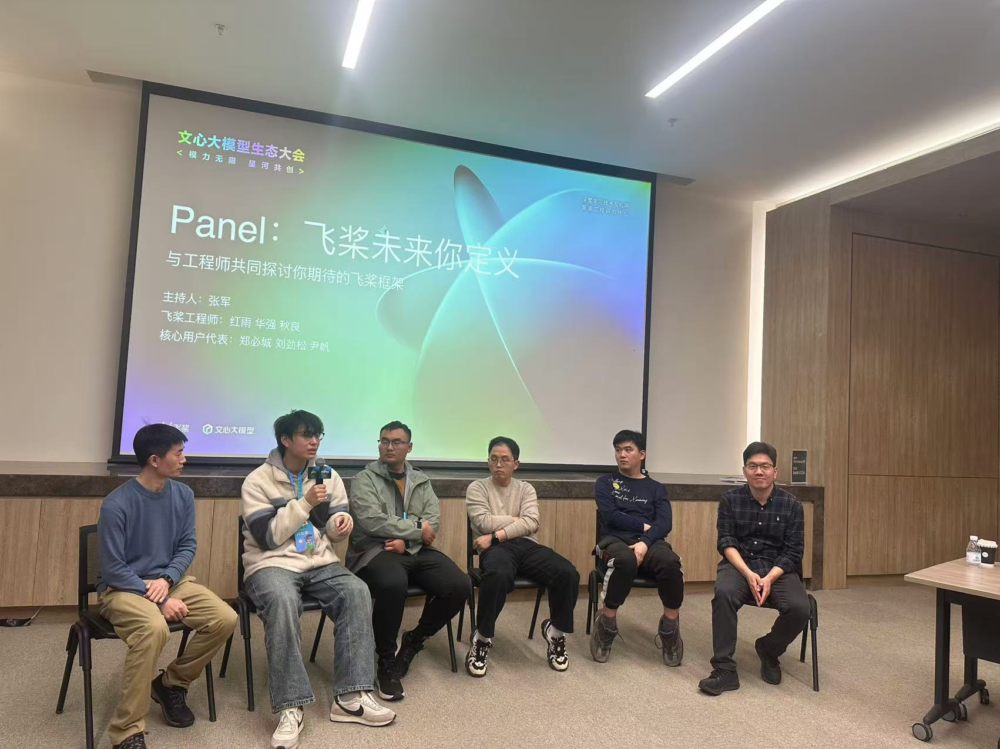
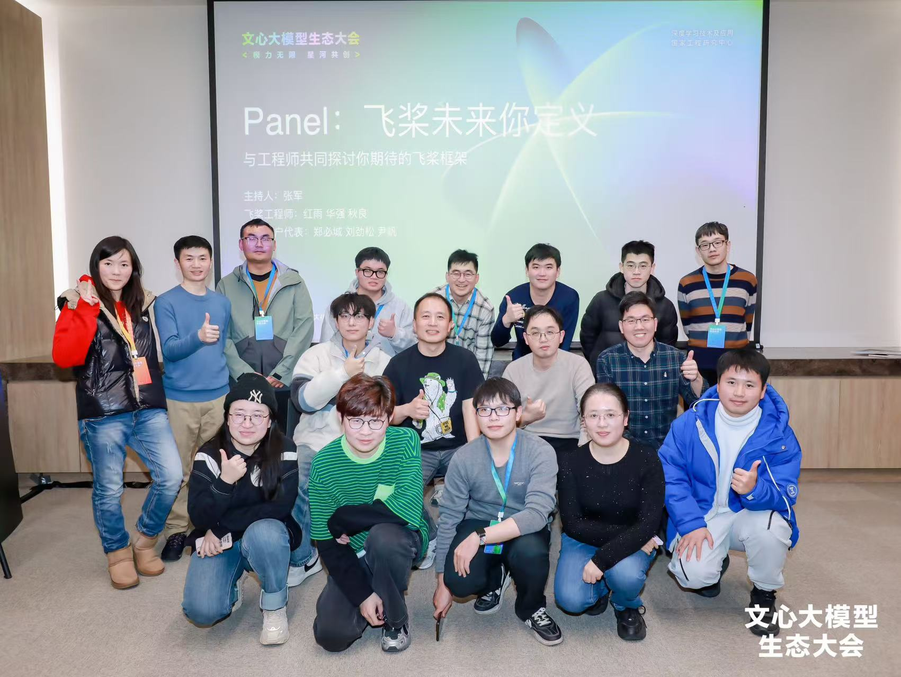
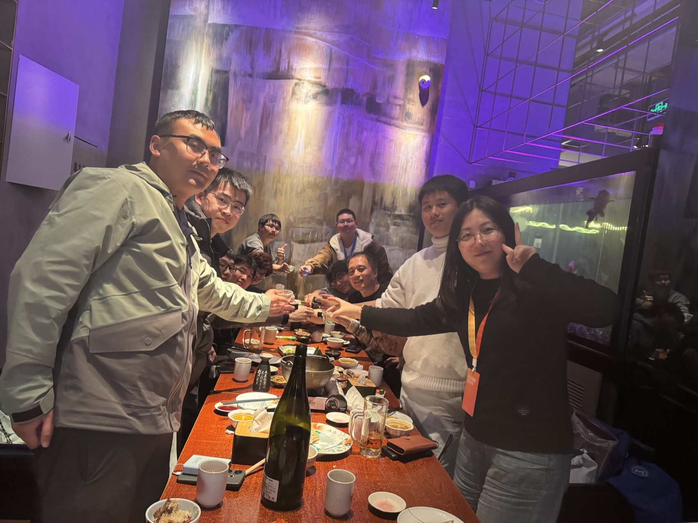

# PaddlePaddle Shanghai Meetup 2024-Winter

## Basic Info

- **Where**: 上海张江科学会堂
- **When**: 2024-12-26

## Agenda

**Moderator**: 张军（ [@jzhang533](https://github.com/jzhang533) ）

| 时间        | 时长 | 演讲题目/环节                | 演讲人                                                       |
| ----------- | ---- | ----------------------------- | ------------------------------------------------------------ |
| 17:00-17:15 | 15   | 飞桨框架最新进展              | 刘红雨（[phlrain](https://github.com/phlrain)）               |
| 17:15-17:45 | 30   | Panel：Challenge the engineers         | 刘红雨（[phlrain](https://github.com/phlrain)） 、陈秋良（[zhiqiu](https://github.com/zhiqiu)） 、方华强（[vivienfanghuagood](https://github.com/vivienfanghuagood)） 、刘劲松（[jingsongliujing](https://github.com/jingsongliujing)） 、郑必城（[Zheng-Bicheng](https://github.com/Zheng-Bicheng)） 、尹帆（[yinfan98](https://github.com/yinfan98)）                                |

## After

Tech and Beer !!!

## Memories

